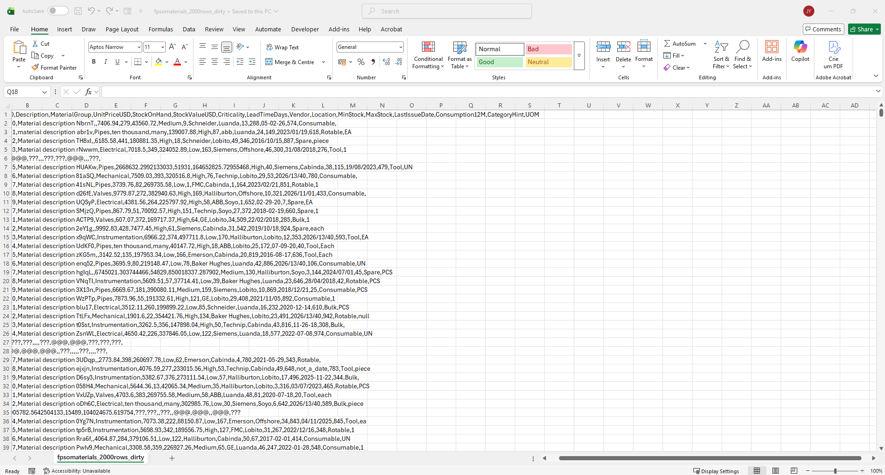
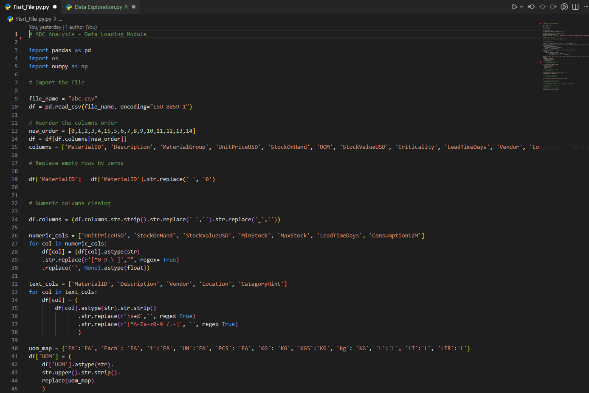
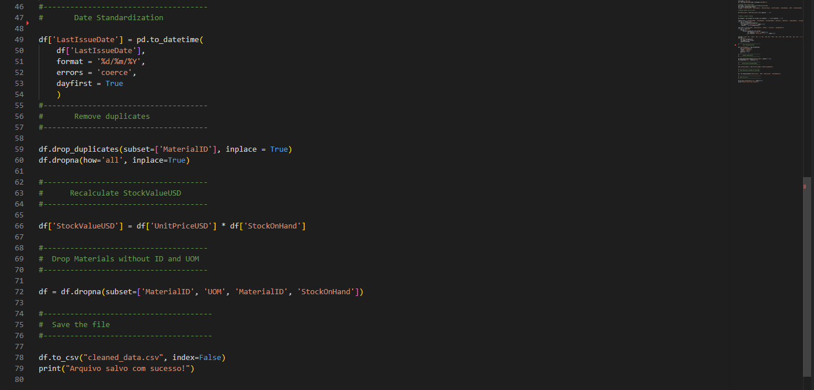
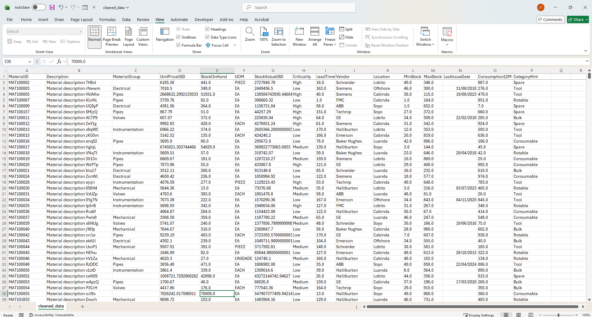
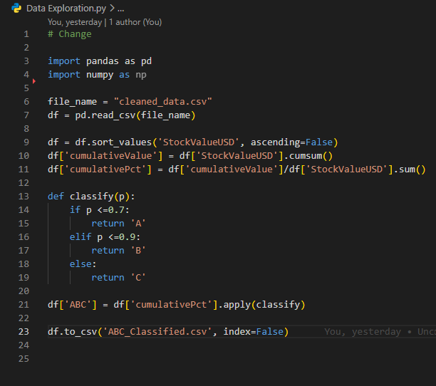
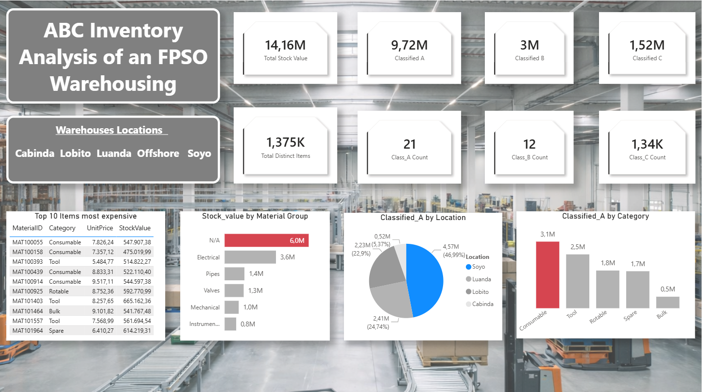

# ABC-Inventory-Analysis-

# Project: ABC Inventory Analysis of an FPSO Warehousing

**Scope:**
- Identify A: Most expensive materials, B: Expensive materials, and C: Cheapest materials
- Locate and quantify the most expensive materials

**Objective:**
- To obtain a comprehensive understanding of the stock inventory
- To detect any irregularities or anomalies within the inventory
- To establish improved stock management procedures

**Assumptions:**
- Stock is assumed to be fully accurate
- Material prices are presumed to be precise

**Tools:**
- Python was utilised for data cleansing and performing ABC classification
- PowerBI was employed for data analysis

*Raw Data*

*Data Cleansing Codes*

*Cleaned Data*

**Classification Methods:**
- Class A: Materials representing 70% of the overall stock value
- Class B: Materials accounting for 20% of the total stock value
- Class C: Materials contributing 10% of the total stock value

*ABC Classification code*

**Insights:**
- Total inventory stock value stands at USD 14.16 million
- There are 1,375,000 distinct material items
- Soyo warehouse contains a higher proportion of Class A materials
- Consumables category holds the most Class A items, which may indicate an anomaly as these are not located offshore where they are typically utilised
- The Material Group labelled ‘N/A’ represents a significant stock value, which could also be considered an anomaly

**Recommendations:**
- Conduct four physical stock counts annually for Class A materials to ensure inventory accuracy and improve preservation
- Carry out two physical stock counts each year for Class B materials for the same purposes
- Complete one physical stock count annually for Class C materials to maintain accuracy and preservation standards
- Review the pricing of the highest-value consumable items, as such high values are unusual for this category
- Encourage collaboration between IT, Materials Management, and Maintenance departments to assign appropriate Material Groups to items currently labelled ‘N/A’.  This will optimise warehouse organisation and material preservation

*Dashboard*

